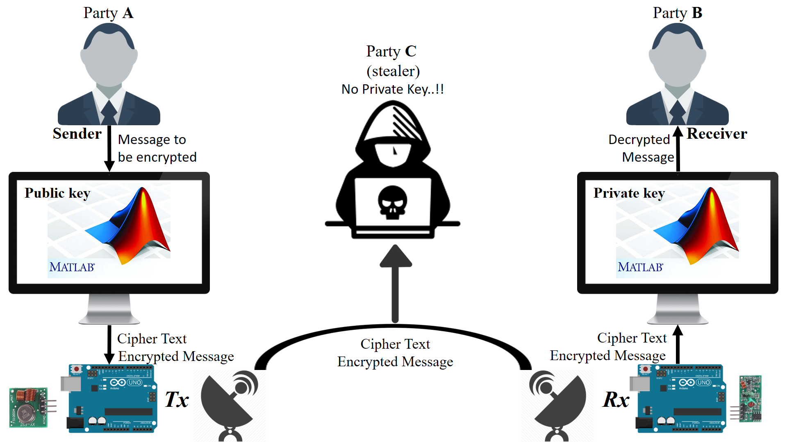
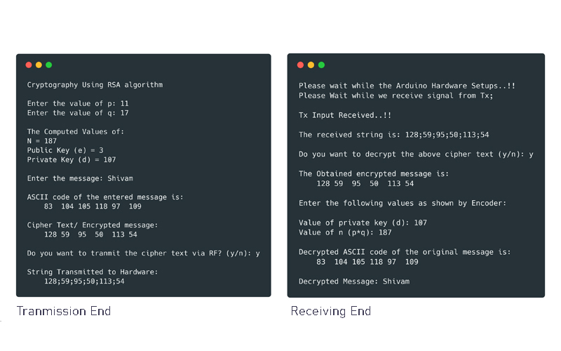
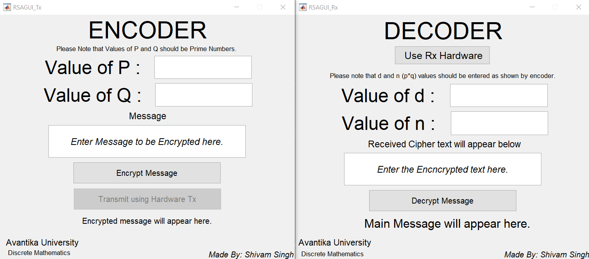

# Secure data transmission system

## MATLAB, Arduino, RSA cryptography

#### About

This project uses integration of MATLAB programming and its support for Arduino Hardware integration and RSA algorithm implementation to encrypt and decrypt messages and sending it wirelessly through RF 433 module and Arduino board. This project is an upgrade of my previous project which uses matrix multiplication method for cryptography (non GUI).

###### Requirements:

* MATLAB (developed in version R2018b)
* Arduino Uno R3 development board
* RF433 module
* Connecting wires
* Antenna

The working of the system is represented below:

#### Usage:

The application can be controlled using both console and GUI under the MATLAB platform.

###### Files to run:

* Transmitter/ encrypt: RSAGUI_Tx.m
* Receiver/ decrypt: RSAGUI_Rx.m

###### Console:

###### GUI:

______

###### Links:

[Documentation](https://www.google.com)

[Behance](https://www.behance.net/gallery/77020937/Secure-data-transmission-system)

